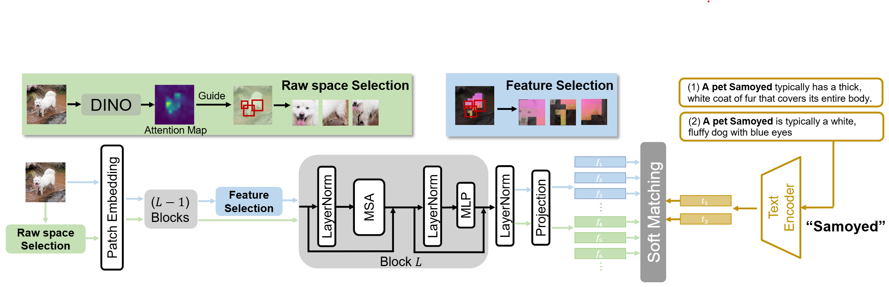

 ---

<div align="center">    
 
# From Local Details to Global Context: Advancing Vision-Language Models with Attention-Based Selection

[ICML2025] Official Code of **ABS**

[Lincan Cai](https://scholar.google.com/citations?user=wH-dNbAAAAAJ&hl=zh-CN&oi=ao), Jingxuan Kang, [Shuang Li](https://shuangli.xyz), [Wenxuan Ma](https://scholar.google.com/citations?hl=zh-CN&user=u7aJOt8AAAAJ), [Binhui Xie](https://binhuixie.github.io), [Zhida Qin](https://zhidaqin.github.io/), [Jian Liang](https://scholar.google.com/citations?user=mrunnpoAAAAJ&hl=zh-CN)



</div>

## Contribution
- We propose an **A**ttention-**B**ased **S**election (**ABS**) to guide the cropping process, focusing on the main objects in the image and minimizing the risk of cropping background objects.
- We introduce a feature selection that cropping at the feature map of the original image to supplement the cropped images with global information, ensuring that the model retains semantic understanding while focusing on local features.
- We propose a soft matching approach, enabling targeted matching of text descriptions to different patches. **ABS** achieves state-of-the-art performance in zero-shot classification and out-of-distribution datasets, even outperforming methods that require finetuning.

## Requirements
- Environment

For proper execution, please ensure Python is installed and all required dependencies are configured by running the following command from the project root directory:
```bash
conda create --name <env> --file requirements.txt

```
- Datasets

To proceed with the experiments, please follow these steps:
1. Download the required dataset, please refer to [Dataset.md](https://github.com/BIT-DA/ABS/blob/main/data/README.md)
2. Update the corresponding `data_path` parameter in the configuration files located in the `cfgs` folder to point to your local dataset directory.

## Experiment with zero-shot and OOD Benchmark
Run the following command:
```bash
python main.py --dataset_name imagenet

```
where `dataset_name` specifies the dataset to be used.

## Acknowledgements
This project is based on the project: [WCA](https://github.com/tmlr-group/WCA). We thank the authors for making the source code publicly available.
